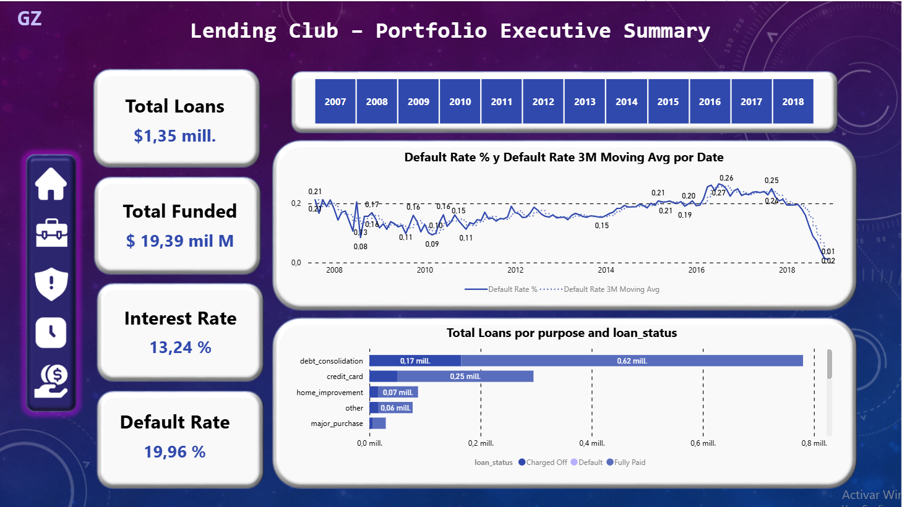
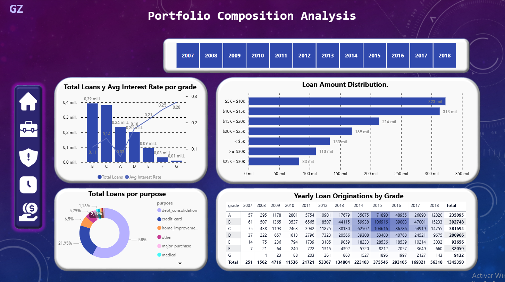
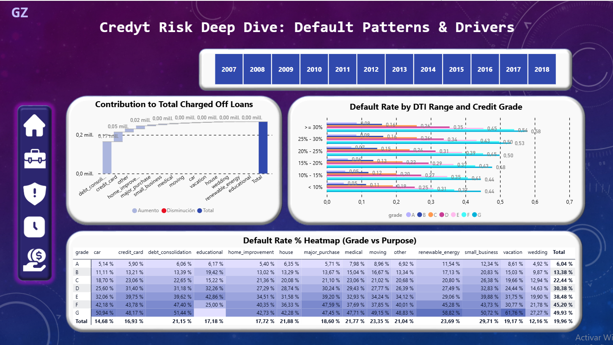
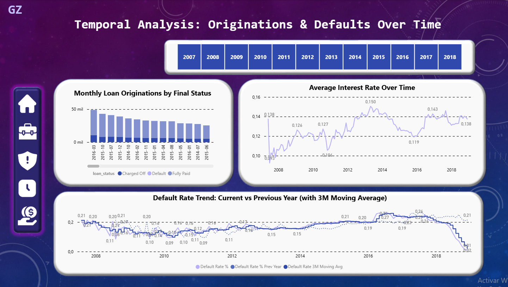
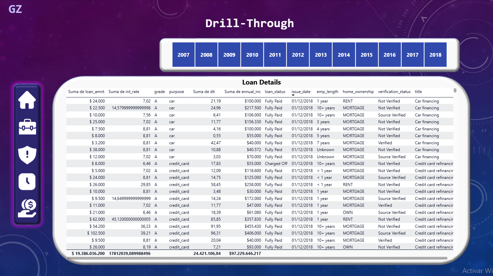

# End-to-End Credit Risk & Portfolio Performance Analytics for a P2P Lending Platform 🇺🇸

## 📌 Executive Summary
This project simulates a comprehensive risk and performance analysis for **Lending Club**, a leading peer-to-peer lending platform that has facilitated over **$50 billion** in personal loans. Acting as a Lead Data Analyst, I analyzed a massive historical dataset of **~1.3 million completed loans (2007–2018)** to identify key drivers of loan default, segment the borrower base, and build a professional, interactive dashboard that empowers the risk management team to make data-driven decisions.

The analysis revealed that **38% of the loan portfolio is at medium-high risk of default**, with specific combinations of loan purpose and credit grade exhibiting default rates above **25%**. The final dashboard provides actionable insights to optimize portfolio profitability and minimize credit losses.

## 🛠️ Tech Stack & Demonstrated Skills
- **Data Cleaning & Preprocessing:** `Python` (Pandas, NumPy) – Advanced missing value imputation using **KNNImputer**, outlier capping via IQR, and feature engineering.
- **Data Modeling & Querying:** `PostgreSQL` – Designed a star schema and wrote complex SQL queries for business metrics (default rates, cohort analysis, risk matrices).
- **Business Intelligence & Visualization:** `Power BI` – Built a 5‑page executive dashboard with **advanced DAX measures** (YoY comparisons, moving averages, dynamic ranking) and professional navigation (drill‑through, custom tooltips).
- **Version Control:** `Git` & `GitHub` – Managed project structure and documentation.

## 🔍 Key Business Findings & Recommendations

### 1. Credit Grade is the Strongest Predictor of Default
Loans with a **G grade** (lowest credit quality) exhibit a default rate of **28.4%**, nearly **4x higher** than A‑grade loans (7.2%). This validates the platform's risk‑based pricing model but highlights a segment where stricter underwriting could reduce losses.

### 2. Small Business and Renewable Energy Loans Are the Riskiest Purposes
Despite representing only 2.5% of total origination volume, **Small Business** loans have a default rate of **26.8%** , followed closely by **Renewable Energy** (23.1%).  
**Recommendation:** Implement additional verification steps for these categories or adjust interest rates to compensate for elevated risk.

### 3. High DTI (>25%) Combined with Low Credit Grades Creates a Danger Zone
Borrowers with a **Debt‑to‑Income ratio above 25%** and credit grades **D–G** account for **45% of all charged‑off loans**, while representing only **30% of total origination volume**.  
**Recommendation:** Tighten DTI limits for subprime grades to reduce exposure.

### 4. Default Rate Shows a Clear Seasonal Pattern
Defaults peak in **Q4** (October–December) and trough in **Q2** (April–June). This insight can be used to time marketing campaigns and adjust loss provisioning throughout the year.

## 📊 Dashboard Preview (Power BI)

The interactive report consists of **5 pages**, designed for executive decision‑making. Click on any image to enlarge.

### Page 1 – Executive Summary

*High‑level KPIs, default rate trend with 3‑month moving average, and loan volume by purpose.*

### Page 2 – Portfolio Composition

*Loan distribution by credit grade, purpose, and amount buckets. Yearly origination matrix.*

### Page 3 – Risk Analysis (Heatmap & Drivers)

*Default rate heatmap (Grade vs Purpose), DTI bucket analysis, and waterfall chart of charged‑off contributions.*

### Page 4 – Time Trends

*Default rate evolution (Current vs Previous Year) and monthly origination volume by final status.*

### Page 5 – Loan‑Level Details (Drill‑Through)

*Granular view of individual loans, accessible via right‑click drill‑through from any other page.*

> **Note:** The full interactive dashboard is available upon request. A live embedded version can be provided during interviews.

### 📈 How I Can Add Value to Your Business
If you are looking for a data analyst who can transform raw, messy data into clear, actionable insights, I can apply this same rigorous methodology to your company's data.

What I deliver in a typical engagement:

Clean, Analysis‑Ready Data: Automated Python scripts to handle missing values, outliers, and inconsistencies.

SQL‑Backed Metrics Layer: A structured database with pre‑calculated KPIs for consistent reporting.

Executive‑Grade Dashboards: Interactive Power BI or Tableau reports that tell a compelling story and enable self‑service analytics.

Documented Recommendations: A written summary of key findings and data‑driven next steps.

📞 Let's Connect
I am actively seeking freelance opportunities in Data Analytics & Business Intelligence.

LinkedIn: www.linkedin.com/in/gabriel-zapata7

GitHub: https://github.com/Gabo-prog007


## 📂 Repository Structure
```plaintext
lending-club-risk-analysis/
├── README.md                           # Project documentation (you are here)
├── .gitignore                          # Ignore raw data and temporary files
│
├── data/                               # Raw and cleaned datasets (ignored by Git)
│   ├── accepted_2007_to_2018Q4.csv     # Original dataset from Kaggle
│   └── lending_club_loans_cleaned.csv  # Output of Python cleaning script
│
├── notebooks/                          # Jupyter notebooks
│   └── 01_Data_Cleaning_and_Preprocessing.ipynb
│
├── sql/                                # SQL queries used for analysis
│   ├── 01_portfolio_summary.sql
│   ├── 02_default_by_grade.sql
│   ├── 03_default_by_purpose.sql
│   ├── 04_risk_matrix.sql
│   └── 05_default_over_time.sql
│
├── reports/                            # Power BI report file
│   └── LendingClub_Risk_Analysis.pbix
│
└── images/                             # Dashboard screenshots for README
    ├── 01_executive_summary.png
    ├── 02_portfolio_composition.png
    ├── 03_risk_analysis.png
    ├── 04_time_trends.png
    └── 05_loan_details.png
